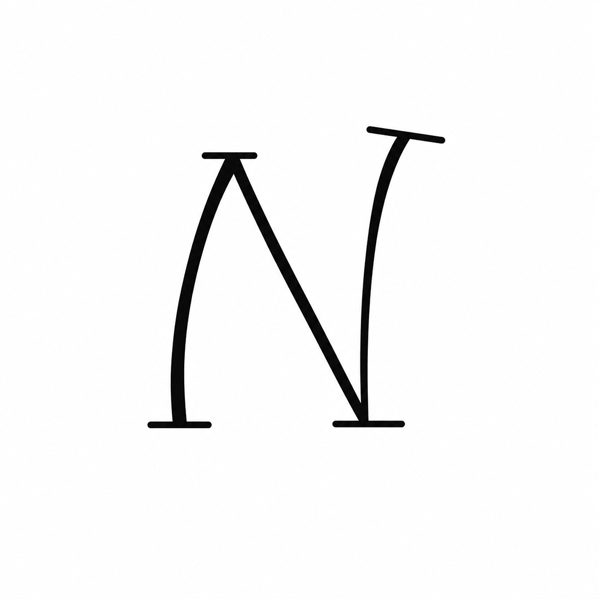
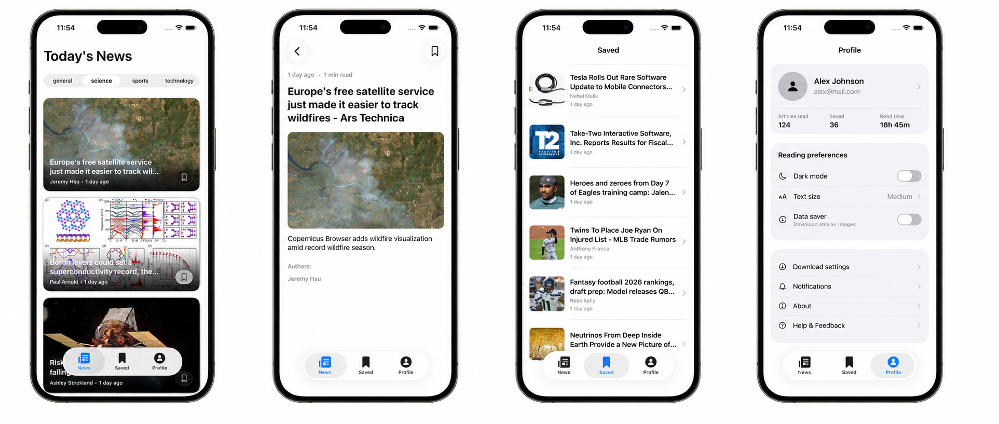
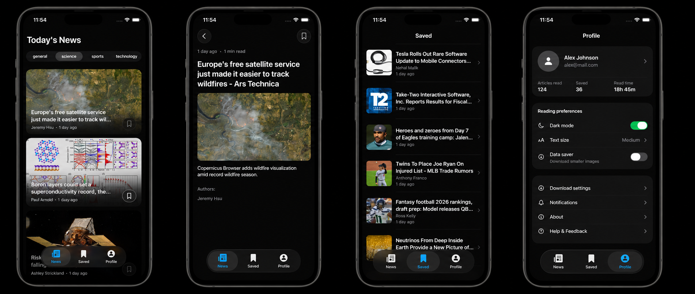

# Newz

A modern news reader app built with SwiftUI, featuring a beautiful glass-morphism design, dark mode support, and offline article saving.

## 📱 Screenshots

| Light Mode | Dark Mode |
|------------|-----------|
|  |  |

## 🛠 Tech Stack

### Architecture
- **MVVM + Clean Architecture** — Clear separation of concerns
- **Dependency Injection** — Custom scope-based DI system for modularity
- **Protocol-Oriented Programming** — Protocols for all major components

### Key Technologies
- **SwiftUI** — Modern declarative UI framework
- **SwiftData** — Local persistence for saved articles
- **Combine** — Reactive programming for network calls and state management
- **NewsAPI** — Real-time news data from [newsapi.org](https://newsapi.org)
